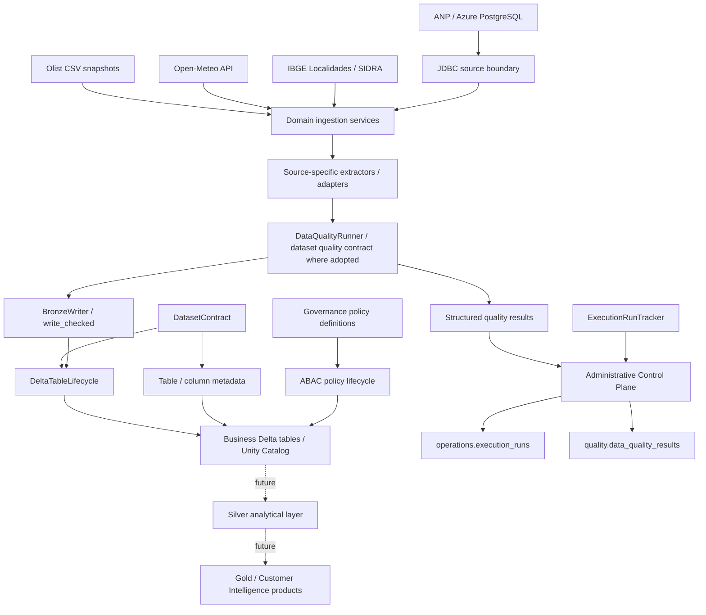
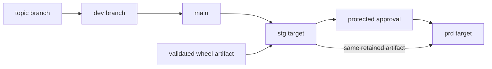
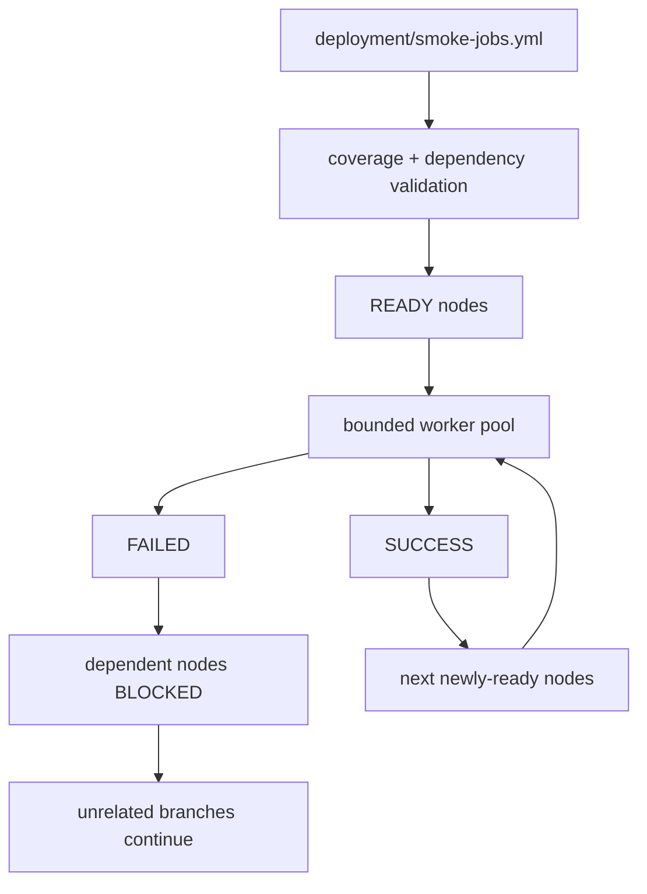

# Architecture

## System view

Olist Customer Intelligence is currently a Bronze/platform foundation for a future Customer Intelligence data product. The architecture separates source/domain behavior, reusable platform capabilities, the business Data Plane, the administrative Control Plane and deployment concerns.



Solid edges represent delivered platform behavior. The GDP workload was the first consumer of the first-class Data Quality path; adoption now varies by dataset and must be read from Platform Status rather than inferred from Bronze delivery alone. Dotted edges represent future analytical layers and must not be interpreted as delivered Silver/Gold products.

The ANP path is intentionally different from the file/API sources: the implementation is present in `main` and the Azure PostgreSQL/JDBC workload is runtime-accepted in DEV, while STG/PRD PostgreSQL source endpoints remain intentionally unconfigured. Environment readiness is a status concern, not an architectural inference from code presence.

## Application architecture

The Python package follows a hybrid **Platform + Domains** structure:

```text
olist_data_platform/
├── platform/
│   ├── delta/
│   ├── governance/
│   ├── http/
│   ├── logging/
│   ├── operations/
│   └── quality/
├── domains/
│   ├── ingestion/
│   ├── bronze/
│   ├── silver/
│   ├── gold/
│   └── customer_intelligence/
└── jobs/
```

Responsibilities are intentionally separated:

- **platform** — reusable technical behavior such as contracts, Delta lifecycle, HTTP, logging, execution tracking, Data Quality mechanics and governance lifecycle;
- **domains/ingestion** — source communication, parsing and ingestion orchestration;
- **domains/bronze** — persisted Bronze dataset contracts/adapters and dataset-specific Data Quality semantics;
- **jobs** — executable application composition;
- **DAB / GitHub Actions** — deployment, environment and promotion concerns.

## Data Plane and Control Plane

Business datasets and platform-operational evidence use separate Unity Catalog boundaries.

```text
<data_catalog>                  <admin_catalog>
├── bronze                      ├── operations
├── silver                      │   └── execution_runs
└── gold                        └── quality
                                    └── data_quality_results
```

`operations.execution_runs` records one logical execution lifecycle. `quality.data_quality_results` stores one structured result per evaluated rule/scope and correlates to the execution through the same `run_id`. Runtime/application logs remain in their native logging systems rather than being duplicated into Delta.

Catalog and schema provisioning are infrastructure prerequisites. Application code may create and reconcile its managed tables through `DatasetContract` and `DeltaTableLifecycle`, but does not create catalogs or schemas implicitly.

## Bronze boundary

Bronze is the first persistent landing layer; there is no separate persistent RAW layer in the current design.

The layer prioritizes source fidelity:

- AS-IS/source-like semantics;
- explicit technical lineage;
- deterministic logical keys where the source provides meaningful row identity;
- idempotent/repeatable writes according to the source contract;
- `VARIANT` payload preservation where useful;
- no premature business normalization.

`DatasetContract` is the authoritative persisted-table contract. `DeltaTableLifecycle` owns creation, inspection, compatible metadata reconciliation and controlled evolution. `BronzeWriter` owns batch preparation and write semantics such as `MERGE`, `FULL_REPLACE` and explicit bounded reprocessing.

Where the first-class Data Quality path is adopted, a separate `DataQualityContract` is evaluated before the protected write. Failed `ERROR` rules persist their evidence and reject the batch. Passing key-integrity evidence may be carried in `QualityCheckedBatch` and consumed by `BronzeWriter.write_checked()` so equivalent key scans are not deliberately repeated.

## Delivery plane

Deployment is deliberately outside application/domain code.



The stable `main` branch is the shared deployment source. Staging validates the exact approved artifact before production promotion. Runtime code receives environment-specific object names from deployment configuration rather than hardcoding `dev`, `stg` or `prd` decisions.

### Deployment-smoke DAG

Deployment smoke orchestration is manifest-driven and dependency-aware.



Each smoke contract declares its complete runtime `arguments` and explicit `depends_on` relationships. The runner rejects missing coverage, unknown dependencies and cycles before starting Databricks jobs.

Execution is readiness-based rather than a fixed Bronze/Silver/Gold wave barrier:

- a node becomes runnable when all of its own dependencies are `SUCCESS`;
- independent nodes may execute concurrently;
- concurrency is bounded (`max_workers=4` by default);
- a failed upstream blocks only its dependency closure;
- unrelated DAG branches continue;
- the overall smoke command fails when any node ends `FAILED` or `BLOCKED`.

The first accepted STG runtime of this scheduler completed 13/13 current smoke nodes successfully and reduced the observed deployment-smoke wall-clock from roughly 59 minutes in the preceding sequential run to roughly 14m23s. This validates the scheduler and representative deployment paths, not full runtime regression of every dataset.

## Environment boundary

```text
dev -> data catalog dev -> admin catalog dev_admin
stg -> data catalog stg -> admin catalog stg_admin
prd -> data catalog prd -> admin catalog prd_admin
```

Catalog-level Data Plane / Control Plane isolation is implemented across the three DAB targets.

Identity separation must distinguish **current state** from **target architecture**:

- the lab STG/PRD Control Plane delivery has been validated using the shared `olist-ci` workload identity with explicit grants;
- stronger least-privilege, per-environment workload-identity separation remains target architecture;
- documentation must not describe that target separation as already implemented evidence.

Production promotion remains protected and must reuse the staging-approved artifact. Workload access to the relevant Data Plane and Control Plane is an explicit environment prerequisite.

## Governance boundary

Governance uses two distinct models:

1. **dataset attributes** — table/column descriptions and approved tags declared through contracts;
2. **access policies** — centralized governance policy definitions/lifecycle for row filters and column masks.

The project does not fabricate sensitivity labels for public datasets solely to demonstrate security features.

## Testing boundary

Local CI covers unit/integration tests, lint/type checks, packaging, DAB validation and documentation. Databricks workspace validation covers behaviors that local Spark cannot faithfully prove, including deployment, Unity Catalog metadata, managed Delta behavior, Data Quality persistence/write gates and selected governance capabilities.

Deployment smoke is a separate evidence class from per-dataset runtime acceptance:

- **deployment smoke** proves the declared representative post-deploy path and artifact/environment wiring;
- **runtime acceptance** proves the feature-specific runtime semantics required by that dataset;
- **idempotence/reprocessing evidence** proves repeatable behavior when required by the accepted contract;
- **full regression** is intentionally not executed for every pipeline on every deployment.

Current environment-by-environment evidence is canonical in `docs/platform-status.md`.
