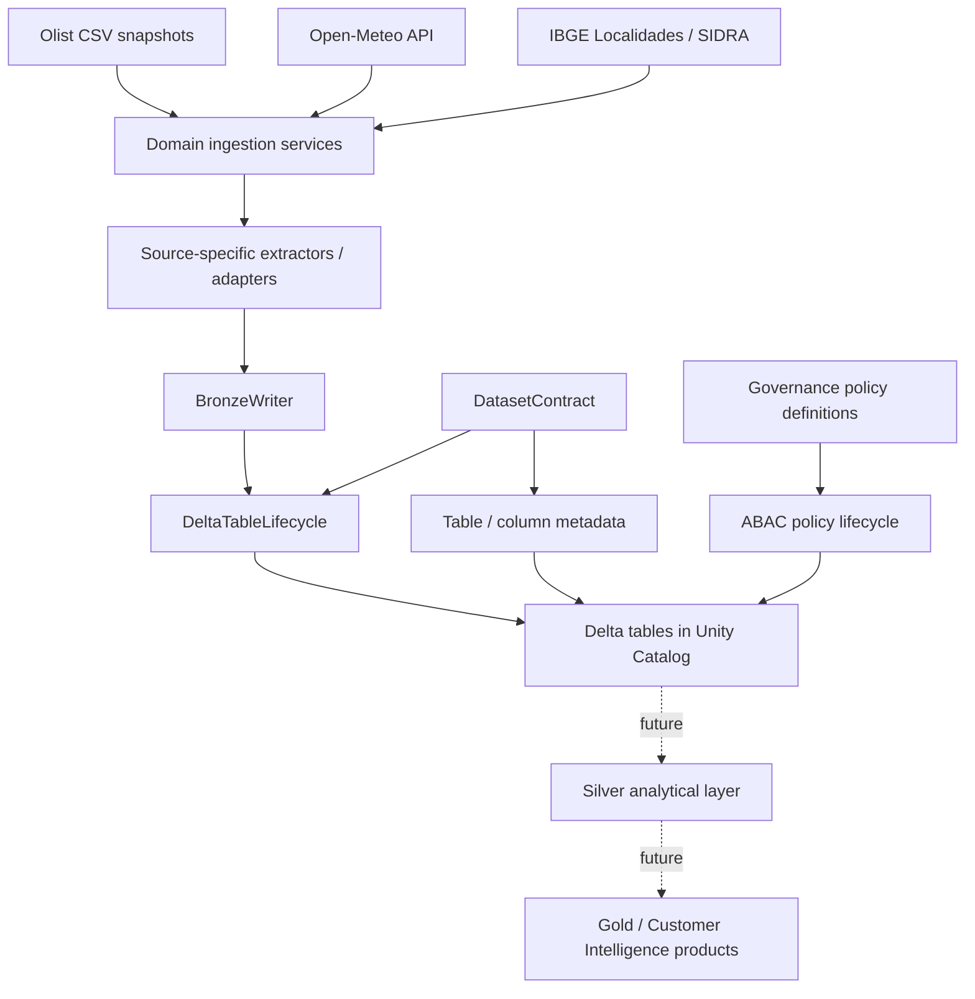
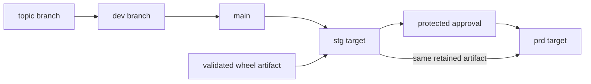

# Architecture

## System view

Olist Customer Intelligence is currently a Bronze/platform foundation for a future Customer Intelligence data product. The architecture separates source/domain behavior, reusable platform capabilities and deployment concerns.



Solid edges represent delivered platform behavior. Dotted edges represent future analytical layers and must not be interpreted as delivered Silver/Gold products.

## Application architecture

The Python package follows a hybrid **Platform + Domains** structure:

```text
olist_data_platform/
├── platform/
│   ├── delta/
│   ├── governance/
│   ├── http/
│   └── logging/
├── domains/
│   ├── ingestion/
│   ├── bronze/
│   ├── silver/
│   ├── gold/
│   └── customer_intelligence/
└── jobs/
```

Responsibilities are intentionally separated:

- **platform** — reusable technical behavior such as contracts, Delta lifecycle, HTTP, logging and governance lifecycle;
- **domains/ingestion** — source communication, parsing and ingestion orchestration;
- **domains/bronze** — persisted Bronze dataset contracts/adapters;
- **jobs** — executable application composition;
- **DAB / GitHub Actions** — deployment, environment and promotion concerns.

## Bronze boundary

Bronze is the first persistent landing layer; there is no separate persistent RAW layer in the current design.

The layer prioritizes source fidelity:

- AS-IS/source-like semantics;
- explicit technical lineage;
- deterministic logical keys;
- idempotent writes;
- `VARIANT` payload preservation where useful;
- no premature business normalization.

`DatasetContract` is the authoritative persisted-table contract. `DeltaTableLifecycle` owns creation, inspection, compatible metadata reconciliation and controlled evolution. `BronzeWriter` owns batch preparation and write semantics such as `MERGE`, `FULL_REPLACE` and explicit reprocessing.

## Delivery plane

Deployment is deliberately outside application/domain code.



The stable `main` branch is the shared deployment source. Staging validates the exact approved artifact before production promotion. Runtime code receives environment-specific object names from deployment configuration rather than hardcoding `dev`, `stg` or `prd` decisions.

## Environment boundary

```text
dev -> catalog dev
stg -> catalog stg
prd -> catalog prd
```

Staging and production use environment-scoped service-principal identities. Production promotion is protected and must reuse the staging-approved artifact.

## Governance boundary

Governance uses two distinct models:

1. **dataset attributes** — table/column descriptions and approved tags declared through contracts;
2. **access policies** — centralized governance policy definitions/lifecycle for row filters and column masks.

The project does not fabricate sensitivity labels for public datasets solely to demonstrate security features.

## Testing boundary

Local CI covers unit/integration tests, lint/type checks, packaging and documentation. Databricks workspace smoke validation covers behaviors that local Spark cannot faithfully prove, including deployment, Unity Catalog metadata, managed Delta behavior and selected governance capabilities.

The deployment smoke layer is intentionally smaller than full regression. Expanding targeted smoke coverage without turning deployment into an expensive full-pipeline test suite is tracked as technical debt.
