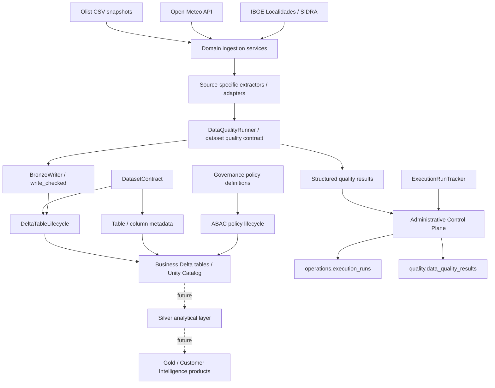
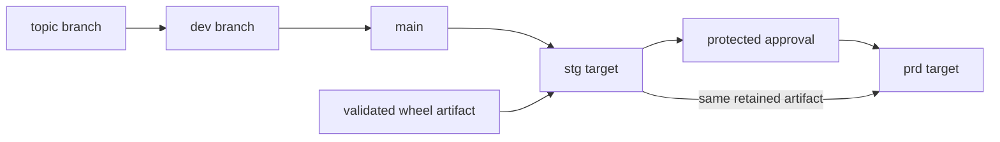

# Architecture

## System view

Olist Customer Intelligence is currently a Bronze/platform foundation for a future Customer Intelligence data product. The architecture separates source/domain behavior, reusable platform capabilities, the business Data Plane, the administrative Control Plane and deployment concerns.



Solid edges represent delivered platform behavior. The GDP workload is the first consumer of the first-class Data Quality path; non-migrated Bronze datasets continue using their existing contract/source/writer validations. Dotted edges represent future analytical layers and must not be interpreted as delivered Silver/Gold products.

## Application architecture

The Python package follows a hybrid **Platform + Domains** structure:

```text
olist_data_platform/
├── platform/
│   ├── delta/
│   ├── governance/
│   ├── http/
│   ├── logging/
│   ├── operations/
│   └── quality/
├── domains/
│   ├── ingestion/
│   ├── bronze/
│   ├── silver/
│   ├── gold/
│   └── customer_intelligence/
└── jobs/
```

Responsibilities are intentionally separated:

- **platform** — reusable technical behavior such as contracts, Delta lifecycle, HTTP, logging, execution tracking, Data Quality mechanics and governance lifecycle;
- **domains/ingestion** — source communication, parsing and ingestion orchestration;
- **domains/bronze** — persisted Bronze dataset contracts/adapters and dataset-specific Data Quality semantics;
- **jobs** — executable application composition;
- **DAB / GitHub Actions** — deployment, environment and promotion concerns.

## Data Plane and Control Plane

Business datasets and platform-operational evidence use separate Unity Catalog boundaries.

```text
<data_catalog>                  <admin_catalog>
├── bronze                      ├── operations
├── silver                      │   └── execution_runs
└── gold                        └── quality
                                    └── data_quality_results
```

`operations.execution_runs` records one logical execution lifecycle. `quality.data_quality_results` stores one structured result per evaluated rule/scope and correlates to the execution through the same `run_id`. Runtime/application logs remain in their native logging systems rather than being duplicated into Delta.

Catalog and schema provisioning are infrastructure prerequisites. Application code may create and reconcile its managed tables through `DatasetContract` and `DeltaTableLifecycle`, but does not create catalogs or schemas implicitly.

## Bronze boundary

Bronze is the first persistent landing layer; there is no separate persistent RAW layer in the current design.

The layer prioritizes source fidelity:

- AS-IS/source-like semantics;
- explicit technical lineage;
- deterministic logical keys;
- idempotent writes;
- `VARIANT` payload preservation where useful;
- no premature business normalization.

`DatasetContract` is the authoritative persisted-table contract. `DeltaTableLifecycle` owns creation, inspection, compatible metadata reconciliation and controlled evolution. `BronzeWriter` owns batch preparation and write semantics such as `MERGE`, `FULL_REPLACE` and explicit reprocessing.

The GDP pilot additionally evaluates a separate `DataQualityContract` before the protected write. Failed `ERROR` rules persist their evidence and reject the batch. Passing key-integrity evidence is carried in `QualityCheckedBatch` and consumed by `BronzeWriter.write_checked()` so equivalent key scans are not deliberately repeated.

## Delivery plane

Deployment is deliberately outside application/domain code.



The stable `main` branch is the shared deployment source. Staging validates the exact approved artifact before production promotion. Runtime code receives environment-specific object names from deployment configuration rather than hardcoding `dev`, `stg` or `prd` decisions.

## Environment boundary

```text
dev -> data catalog dev -> admin catalog dev_admin
stg -> data catalog stg -> admin catalog stg_admin
prd -> data catalog prd -> admin catalog prd_admin
```

Staging and production use environment-scoped service-principal identities. Production promotion is protected and must reuse the staging-approved artifact. Workload access to both the relevant Data Plane and Control Plane remains a least-privilege environment prerequisite.

## Governance boundary

Governance uses two distinct models:

1. **dataset attributes** — table/column descriptions and approved tags declared through contracts;
2. **access policies** — centralized governance policy definitions/lifecycle for row filters and column masks.

The project does not fabricate sensitivity labels for public datasets solely to demonstrate security features.

## Testing boundary

Local CI covers unit/integration tests, lint/type checks, packaging and documentation. Databricks workspace validation covers behaviors that local Spark cannot faithfully prove, including deployment, Unity Catalog metadata, managed Delta behavior and selected governance capabilities.

The GDP Data Quality feature additionally has real DEV evidence for a successful 2018 execution and a deliberate duplicate-key rejection. The rejected validation batch recorded `records_written = 0` and left the isolated Bronze table unchanged, proving the blocking write gate in the target runtime.

The deployment smoke layer remains intentionally smaller than full regression. Expanding targeted smoke coverage without turning deployment into an expensive full-pipeline test suite is tracked as technical debt.
